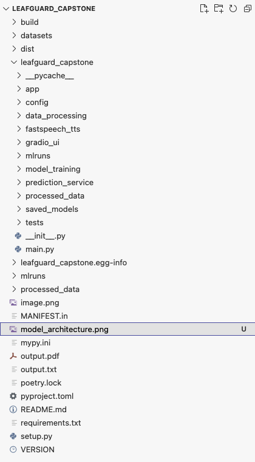
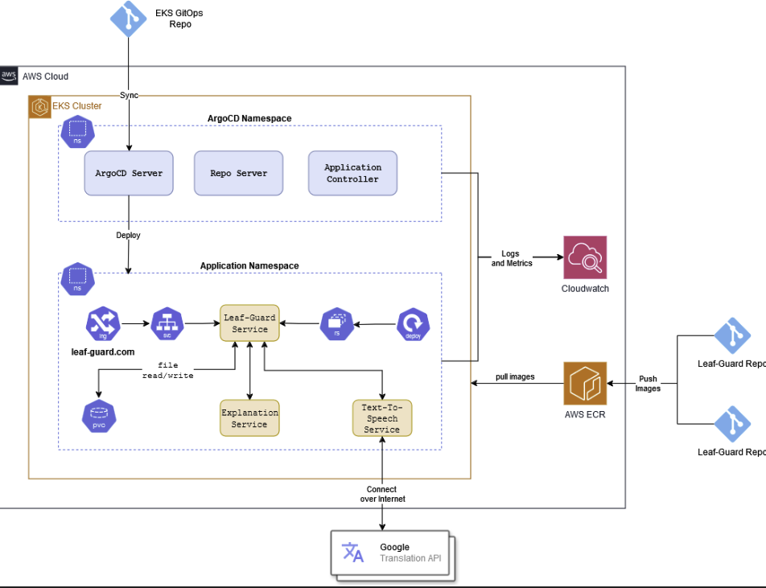

# LeafGuard_2

 # Approach

Plant Disease Detection: Use MobileNetV2, a lightweight convolutional neural network optimized for mobile and embedded vision applications. Pre-trained on the PlantVillage dataset. Generative Explanations: Integrate COTS GPT-3.5/4 for generating detailed disease explanations and treatment recommendations. Multilingual Support: Integrate Google translate for translation into regional languages like Hindi, Tamil, and Telugu. User Interface : Using Gradio, build an intuitive interface to interact with the trained models, and view/hear the generative explanations.

 # Packages and Tools

Data Processing: TensorFlow, PyTorch,pandas, NumPy Model Training and Validation: MobileNetV2, GPT 3.5, sklearn Interface Development: Gradio Multilingual Support : Google translate Deployment: FastAPI for backend services, Docker for containerization Code Versioning: GitHub MLOps Tools: MLflow, ArgoCD, Prometheus, Grafana PaaS: AWS with EKS orchestration Algorithms Convolutional Neural Network (CNN) for image classification (MobileNetV2). Transformer-based model for text generation (GPT-3.5/4).

Metrics Disease Detection: Accuracy, F1-score, Precision, Recall Explanations: BLEU and METEOR score for text quality, Human Evaluation for comprehensiveness and accuracy

Stages And Deliverables Data Preparation Preprocess plant images (resizing, noise removal, augmentations). Curate and preprocess agricultural text data for explanations. Model Implementation Fine-tune MobileNetV2 for plant disease classification. Use commercially off the shelf GPT-3.5/4 for generating explanations and remedies. Interface Development Build a user-friendly Gradio application for image uploads and diagnosis. Incorporate query handling for further explanations. Multilingual Enhancements Integrate and test multilingual support Deployment and Operations Containerize application using Docker Provision AWS infrastructure to perform model training Capture metrics using MLFlow and maintain model versions Deploy trained models on AWS along with the containerized application Monitoring and Alerting Track model metrics using Prometheus and Grafana Create alerts for highlighting deteriorating performance

Deployment Plan Key Components Component Technology Description Frontend (UI) Gradio User interface for uploading images and selecting languages. Backend API FastAPI Handles image processing, diagnosis generation, and translations. Translation API Google Translate Converts diagnostic text to selected language. Containerization Docker Standardizes deployment across environments. Cloud Platform AWS EC2 Hosts backend and frontend, managed with Docker. CI/CD Pipeline GitHub Actions Automated testing, image building, and deployment. Monitoring AWS CloudWatch Monitors application performance and health.

Backend Development (FastAPI) FastAPI Endpoint Setup: Disease Detection: Process plant images and predict diseases using a pre-trained model. Diagnosis Generation: Use the ChatGPT API to generate diagnostic text based on the detected disease. Translation: Convert diagnosis text to the selected language using Google Translate or Azure Translator API. Dockerize FastAPI:Create a Dockerfile to containerize FastAPI, install dependencies, and configure the application. Build and test the Docker image locally. Frontend Development Gradio: Allow users to upload an image and choose a diagnosis language. Use HTTP requests to connect with Gradio endpoints for detection, diagnosis, and translation. Deployment on AWS Backend (FastAPI) Deployment: Deploy the FastAPI Docker container on an AWS EC2 instance. Expose the FastAPI service on port 8000 and ensure security groups allow HTTP/HTTPS traffic. Optional: Use an S3 bucket for storing images if needed for persistent storage. Frontend (Gradio) Deployment: Deploy Streamlit on a separate EC2 instance and connect it to the FastAPI backend. Expose Gradio’s UI on a public IP or domain. CI/CD Pipeline (GitHub Actions) Automated Testing: Use GitHub Actions to set up test workflows to run unit tests for both FastAPI and Gradio code. Docker Image Build and Push: Create workflows to build and push the Docker images to a container registry (e.g., Amazon ECR or Docker Hub). Deployment Workflow: Create a GitHub Actions workflow to deploy to AWS using SSH. Trigger this workflow on successful image build or push. Configure Multilingual Support Translation API Integration: Use the googletrans library or Azure Translator for language support in FastAPI’s /translate_diagnosis endpoint. Allow translations to languages such as Hindi, Tamil, Bengali, etc., and configure this API to return the translated text back to Gradio. Monitoring and Maintenance CloudWatch for Monitoring: Use AWS CloudWatch to track CPU usage, memory, and request latency. Logging: Log application errors and user activities in Gradio and FastAPI for debugging and user experience analysis. Security: Use environment variables for sensitive API keys (ChatGPT and translation APIs) and configure API authentication for FastAPI. Application Architecture:

# Preliminary Exploratory Data Analysis

The PlantVillage dataset consists of 54303 healthy and unhealthy leaf images divided into 38 categories by species and disease. Please find below the label and the distribution count of images present in the dataset.

Label Count Apple___Apple_scab 630 Apple___Black_rot 621 Apple___Cedar_apple_rust 275 Apple___healthy 1645 Blueberry___healthy 1502 Cherry___healthy 854 Cherry___Powdery_mildew 1052 Corn___Cercospora_leaf_spot Gray_leaf_spot 513 Corn___Common_rust 1192 Corn___healthy 1162 Corn___Northern_Leaf_Blight 985 Grape___Black_rot 1180 Grape___Esca_(Black_Measles) 1383 Grape___healthy 423 Grape___Leaf_blight_(Isariopsis_Leaf_Spot) 1076 Orange___Haunglongbing_(Citrus_greening) 5507 Peach___Bacterial_spot 2297 Peach___healthy 360 Pepper,_bell___Bacterial_spot 997 Pepper,_bell___healthy 1477 Potato___Early_blight 1000 Potato___healthy 152 Potato___Late_blight 1000 Raspberry___healthy 371 Soybean___healthy 5090 Squash___Powdery_mildew 1835 Strawberry___healthy 456 Strawberry___Leaf_scorch 1109 Tomato___Bacterial_spot 2127 Tomato___Early_blight 1000 Tomato___healthy 1591 Tomato___Late_blight 1908 Tomato___Leaf_Mold 952 Tomato___Septoria_leaf_spot 1771 Tomato___Spider_mites Two-spotted_spider_mite 1676 Tomato___Target_Spot 1404 Tomato___Tomato_mosaic_virus 373 Tomato___Tomato_Yellow_Leaf_Curl_Virus 5357 Total Count 54303

 # Class Distribution of Plant Village Dataset

Sample Images Expected Outcomes The project’s efficient AI models and scalable deployment deliver accurate, real-time disease detection and treatment advice. This technology empowers farmers to make informed decisions quickly, increasing crop yield and reducing losses, while multilingual support enhances accessibility, driving overall agricultural productivity and food security. Below are the business impacts that can be achieved.

Accurate Disease Detection: The system will deliver high-precision results for identifying plant diseases, even under varying image quality and environmental conditions. Farmers can trust the diagnosis to make timely and informed decisions.

Clear and Actionable Treatment Advice: Generative AI will provide easy-to-understand, practical treatment recommendations tailored to the identified disease. The advice will focus on actionable steps, enabling farmers to implement solutions effectively.

Increased Crop Yield and Reduced Loss: Early and accurate disease detection will minimize crop damage and reduce financial losses. This will contribute to improved agricultural productivity and food security.

User-Friendly and Accessible Interface: The intuitive interface will accommodate farmers with different levels of digital literacy. The system’s design will ensure that even first-time users can easily navigate and benefit from the tool. Project Demonstration Strategy Phase 1: Introduction and Overview of the Project Objective: The project’s goals, methodology, and relevance will be introduced. Plan: A brief introduction to the problem of plant disease detection and the challenges farmers face. The objectives of the project will be outlined, highlighting the use of MobileNetV2 for disease detection and GPT-3.5/4 for generating disease explanations and treatment recommendations. The key methodology behind integrating these AI models will be explained, including how the system is designed to process images, diagnose diseases, and generate actionable advice.

Phase 2: Walkthrough of the System and Interface Objective: The user interface and image upload process will be demonstrated. Plan: Live Demonstration: The audience will be guided through the process of uploading an image of a plant leaf or crop. The system’s processing steps will be demonstrated, showing how it applies the MobileNetV2 model for disease detection and generates a disease diagnosis. The system's ability to handle images of varying quality (e.g., clear vs. low-resolution images) will be demonstrated. System Functionality Check: Prior to the live demonstration, all aspects of the system (image upload, disease detection, and recommendation generation) will be thoroughly tested to ensure everything is working as expected.

Phase 3: Disease Detection and Explanation Generation Objective: The disease detection and explanation generation processes will be shown. Plan: Disease Detection: The output from the MobileNetV2 model will be presented, showcasing the identified disease and its confidence score. Generative AI Explanation: GPT-3.5/4 will be shown generating detailed explanations for the detected disease, including symptoms, causes, and recommended treatments or preventive measures. Examples with different plant diseases (e.g., leaf spot, powdery mildew) will be used to demonstrate how the system handles a variety of plant diseases.

Phase 4: Interactive Query Handling Objective: The system’s ability to respond to follow-up queries will be demonstrated. Plan: The audience will be shown how the system responds to queries such as: “What are the symptoms of this disease?” “How can I prevent this disease from affecting other crops?” The clarity and relevance of the responses generated by the AI will be emphasized, showcasing the system’s potential for providing actionable advice.

Phase 5: Results and Performance Evaluation Objective: The system’s performance will be evaluated and its effectiveness in disease detection demonstrated. Plan: Performance metrics, including accuracy, processing time, and relevance/clarity of generated recommendations, will be presented. Results will be compared to baseline models or other techniques used for plant disease detection. Testing results based on real-world plant disease images will be shown to demonstrate the system’s robustness.

Phase 6: Learnings Objective: The challenges encountered during the development of the system and how they were addressed will be discussed. Plan: The key challenges, such as handling varying image quality, ensuring high accuracy in disease detection, and fine-tuning the Generative AI for agricultural language, will be explained. The solutions implemented, including image preprocessing techniques and model adjustments, will be detailed. Lessons learned from the development process will be shared, focusing on areas like dataset quality and model evaluation.

# Package Structure :

# To run this package:
1. Git Clone : 'https://github.com/shuvayan/LeafGuard_2.git'
2. cd to the folder containing the package contents.
3. Do a pip install -e .
4. Run python leafguard_capstone/main.py --ui
5. Note : Ensure the processed_data folder is loaded with train/test/valid sets.

# Architecture:

# Modeling Architecture :

# Network Diagram :

-- Place the diag here.

# Contributors

ajayaakansha6@gmail.com, 
deepakraina1988@gmail.com, 
dilipjr@hotmail.com, 
harpanhalli.anand@gmail.com, 
narasimha.murthy.pujari@gmail.com, 
narasimha.pujari@outlook.com, 
piyushsharma0306@gmail.com,
sanil.madathil@gmail.com,
shailesh.v3@gmail.com, 
shubhashree.hebri@gmail.com, suyash.work999@gmail.com, 
vasudeva.renjala@gmail.com
